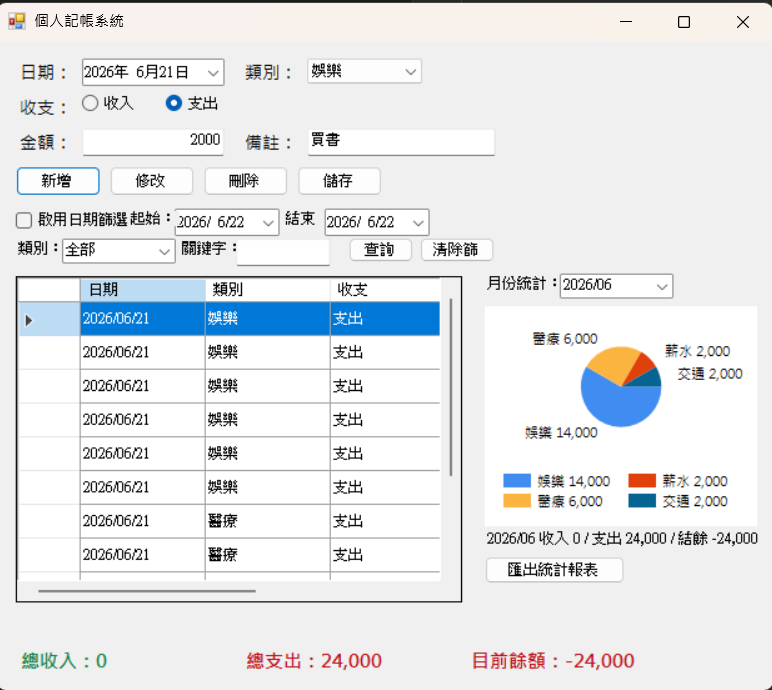

# 個人記帳系統 (Personal Accounting System)

## 專案簡介

本專案為 Windows Forms 視窗程式設計期末專題。

使用 C# 與 Windows Forms 開發個人記帳系統，提供收入與支出管理功能，讓使用者能夠記錄日常收支狀況，並透過統計圖表快速了解個人財務狀況。

---

## 開發環境

- Visual Studio 2022
- C#
- Windows Forms
- .NET Framework

---

## 系統功能

### 1. 新增記帳資料

使用者可輸入：

- 日期
- 類別
- 收支類型
- 金額
- 備註

並新增至記帳資料庫。

---

### 2. 修改資料

選取表格中的資料後可直接修改內容。

---

### 3. 刪除資料

可刪除不需要的記帳紀錄。

---

### 4. 查詢功能

支援：

- 日期區間查詢
- 類別查詢
- 關鍵字查詢

方便快速找到指定資料。

---

### 5. 收支統計

系統自動計算：

- 總收入
- 總支出
- 目前餘額

並顯示於畫面下方。

---

### 6. 圓餅圖分析

利用 Chart 控制項產生：

- 各類別支出比例
- 月份統計分析

讓使用者更容易了解消費習慣。

---

### 7. 存檔功能

使用者可將所有資料儲存至檔案。

---

### 8. 讀檔功能

程式啟動時自動讀取已儲存資料。

---

## 系統畫面

### 主畫面

---

## 操作說明

### 新增資料

1. 選擇日期
2. 選擇類別
3. 選擇收入或支出
4. 輸入金額
5. 輸入備註
6. 按下「新增」

---

### 修改資料

1. 點選表格資料
2. 修改內容
3. 按下「修改」

---

### 刪除資料

1. 點選資料
2. 按下「刪除」

---

### 查詢資料

1. 設定日期範圍
2. 選擇類別
3. 輸入關鍵字
4. 按下「查詢」

---

### 儲存資料

按下「儲存」即可將資料寫入檔案。

---
